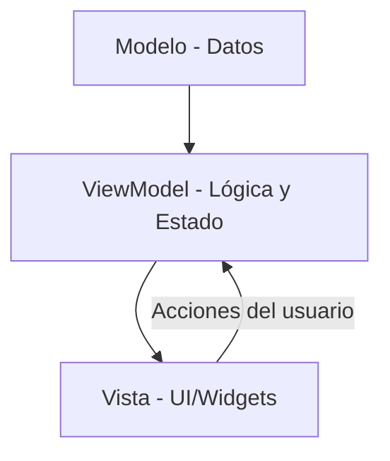

# Guía de Arquitectura: MVVM en InkTrack Proto

Esta guía explica cómo funciona la arquitectura del proyecto, cómo se manejan los estados y cómo interactúan los Modelos, ViewModels y las Vistas (Pages/Widgets).

## 1. El Patrón MVVM

Este proyecto utiliza el patrón **MVVM (Model-View-ViewModel)** junto con `Provider` para el manejo de estados.



### **A. El Modelo (Model)**
Es la representación de los datos. Son clases simples (`class`) que definen qué información tiene un objeto.
- **Ejemplo**: `Producto`, `Venta`, `Proveedor`.
- **Ubicación**: `lib/features/[feature]/models/`

### **B. El ViewModel**
Es el "cerebro" de la aplicación. Maneja el **estado** y la **lógica de negocio**.
- Extiende de `BaseCrudViewModel` (que a su vez extiende de `ChangeNotifier`).
- Contiene una lista de modelos y métodos para modificarlos (`agregar`, `editar`, `eliminar`).
- **Estado**: Cuando algo cambia, llama a `notifyListeners()`, lo que avisa a las Vistas que deben redibujarse.
- **Ubicación**: `lib/features/[feature]/viewmodels/`

### **C. La Vista (View / Pages / Widgets)**
Es la interfaz de usuario que ve el cliente.
- Usa `context.watch<VM>()` o `Consumer<VM>` para escuchar cambios en el ViewModel.
- Usa `context.read<VM>()` para ejecutar acciones (como guardar un producto) sin necesidad de redibujar todo el widget.
- **Ubicación**: `lib/features/[feature]/pages/` o `lib/features/[feature]/widgets/`

---

## 2. Manejo de Estados con Provider

El **Estado** es simplemente la información que tu app necesita recordar en un momento dado (ej: la lista de productos actuales).

### Cómo obtener datos en una Vista:
Existen dos formas principales de acceder al ViewModel desde un widget:

1.  **`context.watch<InventarioViewModel>()`**: Se usa dentro del método `build`. Si el ViewModel cambia (ej: se agrega un producto), el widget se redibuja automáticamente.
2.  **`context.read<InventarioViewModel>()`**: Se usa dentro de funciones como `onPressed`. Te permite llamar a un método del ViewModel sin redibujar el widget innecesariamente.
3.  **`Consumer<InventarioViewModel>`**: Es un widget que envuelve solo la parte de la UI que depende de los datos. Es más eficiente para el rendimiento.

---

## 3. Flujo Completo: Ejemplo de Producto

### Paso 1: Definir el Modelo
```dart
class Producto {
  final String id;
  final String nombre;
  // ...
}
```

### Paso 2: El ViewModel maneja la lista
```dart
class InventarioViewModel extends BaseCrudViewModel<Producto> {
  // BaseCrudViewModel ya tiene una lista llamada 'items'
  
  void guardar(Producto p) {
    // Lógica para guardar...
    notifyListeners(); // <-- ESTO es lo que actualiza la pantalla
  }
}
```

### Paso 3: La Vista muestra y envía datos
```dart
class InventarioPage extends StatelessWidget {
  @override
  Widget build(BuildContext context) {
    // Escuchamos el estado
    final viewModel = context.watch<InventarioViewModel>();
    
    return ListView(
      children: viewModel.items.map((p) => Text(p.nombre)).toList(),
    );
  }
  
  void _onBotonPresionado(BuildContext context) {
    // Ejecutamos una acción (sin redibujar aquí)
    context.read<InventarioViewModel>().guardar(...);
  }
}
```

---

## 4. Consejos para Widgets
- **Dividir y Vencerás**: Si un `build` es muy largo, extrae partes en widgets más pequeños (clases separadas o métodos).
- **Controladores**: Usa `TextEditingController` para capturar texto de los `TextFields`. No olvides llamar a `dispose()` en el `State`.
- **Validación**: Usa `Form` con `GlobalKey<FormState>` y el parámetro `validator` de los `TextFormField` para asegurar que el usuario ingrese datos correctos.
